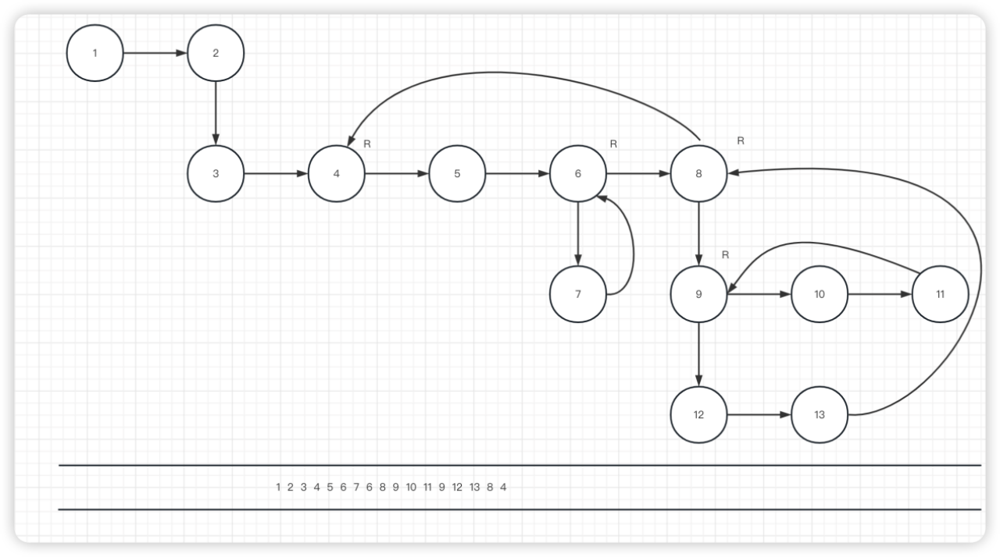

The structure like this:


```rs
struct Item{
  id: i128,
  str:String,
  reduce_resource:Option<Vec<String>>,
  is_freshman:bool,
  is_question:bool,
  left:Option<Item>,
  top:Option<Item>,
  right: Option<Item>,
  bottom: Option<Item>,
}
```





todoing~~~
